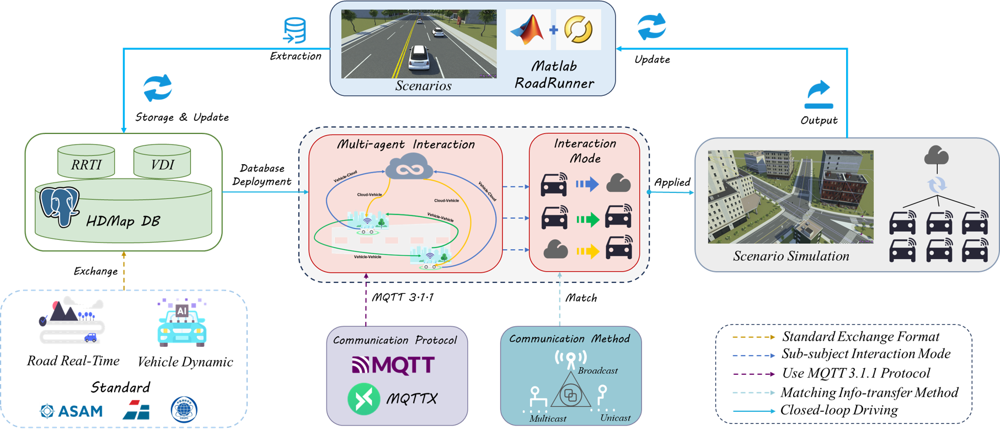

# HDMapII
#  An Approach of High Defintion Map Information Interaction for Connected Autonomous Vehicle

  

> Yanjie Zhang1, Wei Huang1,2,†, Chun Liu2,\*, Hangbin Wu2, Akcram2 
> 1 Urban Mobility Institute, Tongji University, China 2 College of Surveying and Geo-Informatics, Tongji University, China 3 Department of Civil Engineering, Toronto Metropolitan University, Canada 
> \* Equal Contribution † Corresponding Authors

## 📖 News

- `[2024-7-20]` We released our project website [here](https://github.com/yanjie99/HDMapII)

---

## 🎯 Overview
We introduce **HDMapII**, a novel approach to information interaction for connected autonomous vehicles empowered by high-definition maps. HDMapII consists of five main components: the **database** for HD map information management, the **information interaction modes** between autonomous driving vehicle and HD map, the **communication methods** for various types of dynamic information within HD map information database, the information **communication protocol** applied at different interaction modes and the approach to achieving a complete HD map information interaction process.

  

In the RoadRunner simulator, HDMapII utilizes open-source map data, such as OpenStreetMap(OSM), to rebuild real road environment (including lane markings, curbs, surrounding built environment, etc.) and generate HD map data for storage in HD map information database. These scenario data are then used in different information interaction modes respectively and allocated to the corresponding communication methods based on the characteristics of the information itself. Finally, in autonomous driving scenarios, all information interactions between autonomous vehicles and HD maps are conducted based on the MQTT protocol. As the process progresses, newly generated HD map data can be updated to the HD map information database for potential future interactions.

## 🛣️ Demo Video in RoadRunner combined with MATLAB
- Pedestrian Ghost Probe Scenario
<video width="800" controls>
  <source src="videos/PGPS_Final.mp4" type="video/mp4">
</video>

https://www.youtube.com/watch?v=uWJD2UlZEeg

- Unkown of Object Scenario
<video width="800" controls>
  <source src="videos/UOS_Final.mp4" type="video/mp4">
</video>

- Lane Scale Traffic Control Scenario
<video width="800" controls>
  <source src="videos/LSTCS_Final.mp4" type="video/mp4">
</video>

We conduct closed-loop tests in MATLAB. It can be seen that XXX 

## 📄 License

This project is released under the [Apache 2.0 license](LICENSE). 
