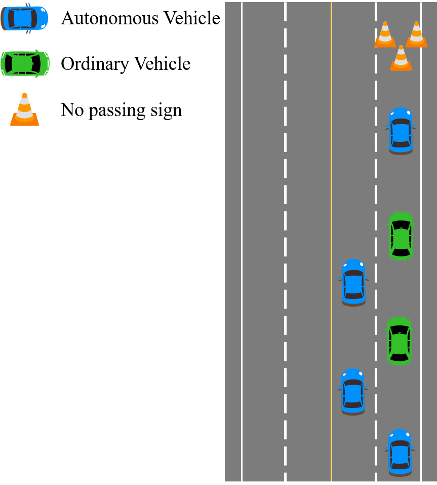

# HDMapII
#  An Approach of High Defintion Map Information Interaction for Connected Autonomous Vehicle

 

[**Yanjie Zhang**](https://yanjie99.github.io/) *&* [**Wei Huang**](https://huangweibuct.github.io/weihuang.github.io/)

<!-- Yanjie Zhang1,\*, Wei Huang1,2,3,\*,†, Akram Akbar2, Hangbin Wu1,2, Chun Liu1,2,\*,† <-->
<!-- 1 Urban Mobility Institute, Tongji University, China 2 College of Surveying and Geo-Informatics, Tongji University, China 3 Department of Civil Engineering, Toronto Metropolitan University, Canada 
> \* Equal Contribution † Corresponding Authors-->

## 📖 News

- `[2024-7-20]` We released our project website [here](https://github.com/yanjie99/HDMapII)

---

## 🎯 Overview
We introduce **HDMapII**, a novel approach to information interaction for connected autonomous vehicles empowered by high-definition maps. HDMapII consists of five main components: the **database** for HD map information management, the **information interaction modes** between autonomous driving vehicle and HD map, the **communication methods** for various types of dynamic information within HD map information database, the information **communication protocol** applied at different interaction modes and the approach to achieving a complete HD map information interaction process.

  

In the RoadRunner simulator, HDMapII utilizes open-source map data, such as OpenStreetMap(OSM), to rebuild real road environment (including lane markings, curbs, surrounding built environment, etc.) and generate HD map data for storage in HD map information database. These scenario data are then used in different information interaction modes respectively and allocated to the corresponding communication methods based on the characteristics of the information itself. Finally, in autonomous driving scenarios, all information interactions between autonomous vehicles and HD maps are conducted based on the MQTT protocol. As the process progresses, newly generated HD map data can be updated to the HD map information database for potential future interactions.

## 📊 Dynamic Informarion
We systematically design the content and exchange format for dynamic information in HD Maps, focusing on two key components: **Road Real-time Information (RRTI)** and **Vehicle Dynamic Information (VDI)**. The following figure illustrates the primary components of this dynamic information. For additional details, please refer to the DynamicInfo.xlsx file.

## 〽️ Information Interaction Modes
We propose three information interaction modes tailored to the various data terminals within HD Maps: Vehicle-to-Cloud mode, Vehicle-to-Vehicle mode and Cloud-to-Vehicle mode.

In Vehicle-to-Cloud mode, the information exchanged from the vehicle terminal to the cloud is mainly the **VDI**, including vehicle status information, temporary traffic sign information, and temporary event information. Information sender is every autonomous vehicle and the reveiver is HD Map cloud databases terminals.

In Vehicle-to-Vehicle mode, the information exchanged from the vehicle end to the vehicle end is mainly the **VDI**, including vehicle status information and temporary road object information. The sender and receiver of the information are different autonomous vehilces.

In Cloud-to-Vehicle mode, the information exchanged from the cloud to the vehicle is mainly the **RRTI**, including traffic signal light information, traffic flow information, traffic control information, traffic event information, and road surface object information. The information sender is HD Map cloud database terminal, and the receivers are any autonomous vehicles that require the data.

## 🛜 Information Communication Protocol
The communication protocol used for information exchange in all modes is [MQTT](https://mqtt.org/). Refer to the diagram below for the communication specifications of each interaction mode.

Messaging Service Levels:
- QoS 0 (At most once): Messages are delivered at most once and are not guaranteed to reach the recipient.
- QoS 1 (At least once): Messages are delivered at least once, there may be duplicate messages, and each message requires an acknowledgement.
- QoS 2 (Exactly once): Messages are ensured to reach the receiver one and only once and are not delivered repeatedly, and uniqueness is guaranteed through a two-stage acknowledgement process.

## 🧩 Scenario Design
To test our proposed information interaction methods, we designed three specific scenarios representing common traffic situations in the physical world to evaluate the effectiveness of the information exchange process. The scenarios are named **Pedestrian Ghost Probe**, **Unknown Object on the Road**, and **Lane-scale Traffic Control**, respectively. Each scenario includes the following components: autonomous vehicles (with communication capability), ordinary vehicles (without communication capability), dynamic objects (such as pedestrian), and static objects (such as unknown objects, traffic signs, etc.).

**Pedestrian Ghost Probe Scenario**
- Participants: 3 Autonomous Vehilces, 2 Ordinary Vehicles, 1 Pedestrian
- Information interaction mode: Vehicle-to-Vehicle 
- Exchange information: VDI (Pavement Object) 

**Unknown Object Scenario**
- Participants: 3 Autonomous Vehicles, 2 Ordinary Vehicles, 1 Static Object
- Information interaction mode: Vehicle-to-Vehicle
- Exchange information: VDI (Pavement Object)

**Lane-scale Traffic Control Scenario**
- Participants: 4 Autonomous Vehicles, 3 Ordinary Vehicles, 1 Traffic Control Sign
- Information interaction mode: Vehicle-to-Vehicle, Vehicle-to-Cloud, Cloud-to-Vehicle
- Exchange information: VDI (Temporary Object), RRTI (Traffic Control)

## 🛣️ Demo Video in RoadRunner combined with MATLAB
The simulation code is available at [./code/PGPS_MatlabCode](), [./code/UOS_MatlabCode](), [./code/LSTCS_MatlabCode]() (Run at Matlab 2024a)

The scenario design code is available at [./code/Scenarios]() (Built by RoadRunner r2024a)

- Pedestrian Ghost Probe Scenario

- Unkown of Object Scenario

- Lane Scale Traffic Control Scenario

We conduct closed-loop tests in MATLAB. It can be seen that HDMapII can provide the prior information for connected autonomous vehicles, enabling them to make timely decisions. In contrast, regular vehicles, lacking interactive support methods, may spend more time on their journeys due to the inability to respond promptly to unexpected situations. 

## 📄 License

This project is released under the [Apache 2.0 license](LICENSE). 

